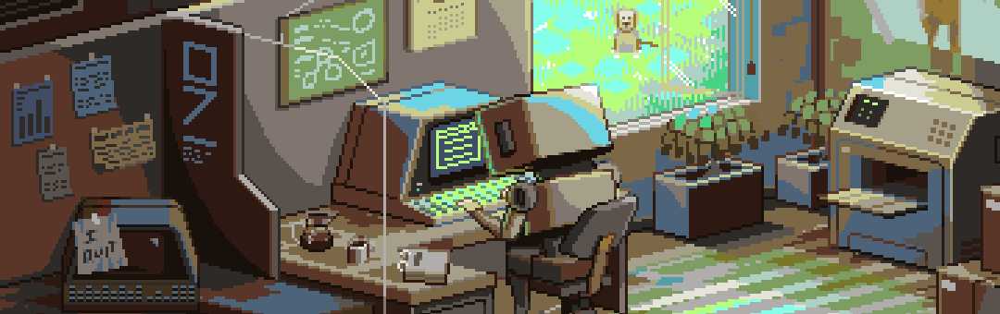

  <h1 align="center"><b>Hello there, I'm Swumplurd 👾</b></h1>

  <h4 align="center"><b>"Si puedes imaginarlo, puedes programarlo"</b></h4>
  <h5 align="center">Programacion ATS</h5>

 
&nbsp;
&nbsp;

 

### Languajes and Tools

  
  
  
  
  
  
  
  
  
  
  
  
  
  
  
  
  
  
  
  
  
  
  
  
  

### Softwares

  
  
  

